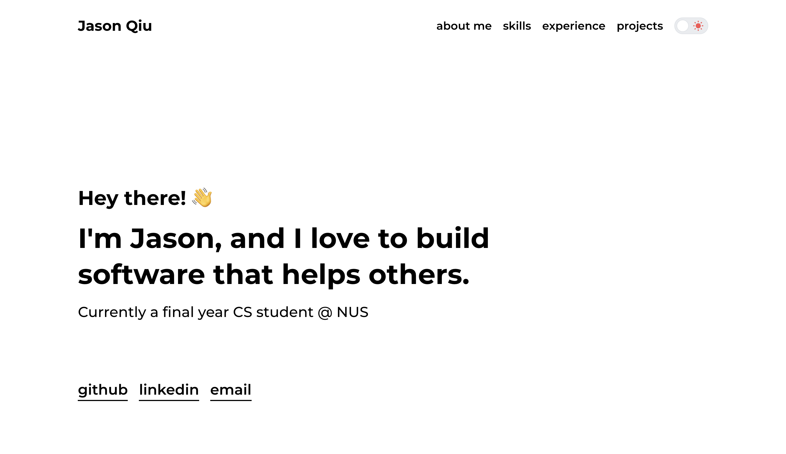

<h1 align="center">
  Jason's Portfolio Website
</h1>

<p align="center">
  <a href="https://jasonqiu.dev" target="_blank">jasonqiu.dev</a>
</p>

<a href="https://jasonqiu.dev" target="_blank">
  
</a>

## 🥞 Tech Stack

Built with [React](https://react.dev/) and [Mantine](https://mantine.dev/), deployed with [Vercel](https://vercel.com/).

## 🛠️ Installation & Setup

1. Clone the project repository.

```
git clone https://github.com/jasonqiu212/portfolio.git
cd portfolio
```

2. Install the necessary packages.

```
npm install
```

3. Start the development server.

```
npm run dev
```
